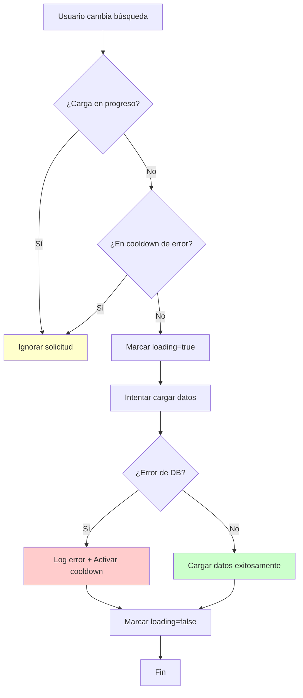

# Plan de Corrección del RecursionError en Aplicación PyQt

## 🎯 Resumen Ejecutivo

**Problema:** `RecursionError: maximum recursion depth exceeded` en el método `load_songs_for_library_view`
**Causa Raíz:** Bucle recursivo causado por `QMessageBox.critical()` modal que interfiere con el bucle de eventos de Qt
**Solución:** Implementar control de re-entrada, debouncing, y logging robusto

## 🔍 Análisis de la Causa Raíz

### Secuencia Problemática Identificada:

1. **Trigger inicial:** `LibraryView.on_search_changed()` → emite señal `search_changed`
2. **MainWindow recibe:** `MainWindow.on_search_changed()` → llama `load_songs_for_library_view(page=1)`
3. **Error en DB:** Falla en `music_service.get_songs()` → excepción se propaga
4. **Manejo problemático:** En `MainWindow.load_songs_for_library_view()` líneas 386-389:
   ```python
   except Exception as e:
       self.statusBar().showMessage(f"Error cargando página {page}: {e}")
       print(f"[MainWindow] Error cargando página {page}: {e}")
       traceback.print_exc()  # ← PROBLEMA POTENCIAL
   ```

5. **Bucle recursivo:** El problema crítico está en las líneas 286-289 de `update_library_filters_and_songs()`:
   ```python
   except Exception as e:
       self.statusBar().showMessage(f"Error actualizando la biblioteca: {e}", 5000)
       QMessageBox.critical(self, "Error de Biblioteca", f"No se pudo actualizar la biblioteca: {e}")
       print(f"[MainWindow] ERROR en update_library_filters_and_songs: {e}")
       traceback.print_exc()  # ← AQUÍ ESTÁ EL PROBLEMA
   ```

### El Bucle Mortal:

- `QMessageBox.critical()` es **modal** y **bloquea el hilo principal**
- Cuando se muestra, puede disparar eventos de Qt que **refrescan la UI**
- Si la UI intenta **revalidar** los componentes de búsqueda durante el modal
- Los widgets de filtro (`QLineEdit`, `QComboBox`) pueden **re-emitir señales**
- Esto vuelve a disparar `on_search_changed()` **mientras el modal está activo**
- El modal se cierra pero **inmediatamente se dispara otra carga**
- Como el error persiste → **bucle infinito**

## 📋 Plan de Implementación Detallado

### 🎯 Objetivos del Refactoring

1. **Eliminar RecursionError** mediante control de re-entrada
2. **Mejorar manejo de errores** sin interferir con el UI loop
3. **Implementar logging robusto** en lugar de `traceback.print_exc()`
4. **Crear debouncing** para prevenir eventos excesivos
5. **Diseñar tests** que detecten y prevengan regresiones

### 📁 Archivos a Modificar

1. `src/database/connection.py` - Excepciones personalizadas y timeouts
2. `src/ui/windows/main_window.py` - Control de re-entrada y manejo de errores
3. `src/ui/components/content_views/library_view.py` - Debouncing de búsquedas
4. `tests/unit/test_recursion_prevention.py` - Tests nuevos
5. `src/utils/error_handler.py` - Nuevo módulo para manejo centralizado de errores

### 🔧 Cambios Específicos por Archivo

#### 1. `src/database/connection.py`
- Añadir excepciones personalizadas: `DatabaseConnectionError`, `DatabaseTimeoutError`
- Mejorar `get_connection()` con timeout explícito
- Implementar logging estructurado
- Manejo resiliente de errores SQLite

#### 2. `src/ui/windows/main_window.py`
- **Añadir al `__init__`:**
  ```python
  self._loading_in_progress = False
  self._last_error_time = None
  self._error_cooldown = 2.0
  self._logger = logging.getLogger(__name__)
  ```
- **Refactorizar `load_songs_for_library_view()` con:**
  - Control de re-entrada
  - Manejo específico de `DatabaseConnectionError`
  - Logging en lugar de `traceback.print_exc()`
  - Cooldown de errores
- **Refactorizar `update_library_filters_and_songs()` eliminando:**
  - `QMessageBox.critical()` en contextos de carga
  - `traceback.print_exc()`

#### 3. `src/ui/components/content_views/library_view.py`
- **Añadir al `__init__`:**
  ```python
  self._search_timer = QTimer()
  self._search_timer.setSingleShot(True)
  self._search_timer.timeout.connect(self._emit_search_changed)
  ```
- **Modificar `on_search_changed()`** para usar debouncing
- **Crear `_emit_search_changed()`** con la lógica original

#### 4. `src/utils/error_handler.py` (NUEVO)
- Configuración de logging centralizada
- Handlers de error consistentes
- Utilidades para cooldown y debouncing
- Patrones de Circuit Breaker

#### 5. `tests/unit/test_recursion_prevention.py` (NUEVO)
- Tests para detectar recursión en `load_songs_for_library_view`
- Verificar cooldown de errores
- Validar debouncing de búsquedas
- Simular errores de DB y verificar recuperación

### ⚡ Orden de Implementación

1. **Paso 1:** Crear `DatabaseConnectionError` y mejorar `connection.py`
2. **Paso 2:** Crear `error_handler.py` con utilidades centralizadas
3. **Paso 3:** Refactorizar `main_window.py` con control de re-entrada
4. **Paso 4:** Implementar debouncing en `library_view.py`
5. **Paso 5:** Crear tests comprehensivos
6. **Paso 6:** Validación y refinamiento

## 🧪 Estrategia de Testing

### Tests Unitarios:
- `test_database_connection_resilience()` - Simular fallos de DB
- `test_main_window_recursion_prevention()` - Detectar bucles
- `test_search_debouncing()` - Validar temporización
- `test_error_cooldown()` - Verificar cooldown funciona

### Tests de Integración:
- `test_full_search_flow_with_db_error()` - Flujo completo con error
- `test_recovery_after_db_restoration()` - Recuperación automática
- `test_ui_remains_responsive()` - UI no se bloquea

## 📊 Patrones de Código a Implementar

### Pattern 1: Circuit Breaker para Carga
```python
class LoadingCircuitBreaker:
    def __init__(self, cooldown=2.0):
        self._loading = False
        self._last_error = None
        self._cooldown = cooldown
    
    def can_execute(self):
        if self._loading:
            return False
        if self._last_error and (time.time() - self._last_error) < self._cooldown:
            return False
        return True
```

### Pattern 2: Debounced Signal Emitter
```python
class DebouncedEmitter(QObject):
    signal_emitted = pyqtSignal(str, str, str)
    
    def __init__(self, delay_ms=300):
        super().__init__()
        self._timer = QTimer()
        self._timer.setSingleShot(True)
        self._timer.timeout.connect(self._emit_signal)
        self._delay = delay_ms
        self._pending_args = None
    
    def emit_debounced(self, *args):
        self._pending_args = args
        self._timer.stop()
        self._timer.start(self._delay)
```

### Pattern 3: Structured Error Handler
```python
class ErrorHandler:
    @staticmethod
    def handle_db_error(logger, error, context=""):
        logger.error(f"Database error in {context}: {error}", exc_info=True)
        return f"Error de base de datos. Ver logs para detalles."
    
    @staticmethod
    def handle_general_error(logger, error, context=""):
        logger.error(f"General error in {context}: {error}", exc_info=True)
        return f"Error inesperado. Ver logs para detalles."
```

## 📊 Métricas de Éxito

- ✅ **Cero RecursionError** en tests de estrés
- ✅ **Tiempo de respuesta UI < 100ms** durante errores
- ✅ **Logging estructurado** con niveles apropiados
- ✅ **Recuperación automática** cuando DB vuelve a estar disponible
- ✅ **Tests passing al 100%** incluyendo edge cases

## 🔄 Diagrama de Flujo de la Solución



## 🚀 Beneficios Esperados

1. **Estabilidad:** Eliminación completa del `RecursionError`
2. **Usabilidad:** UI responsiva incluso durante errores
3. **Mantenibilidad:** Logging estructurado para debugging
4. **Robustez:** Recuperación automática de errores temporales
5. **Testabilidad:** Suite de tests para prevenir regresiones

---

**Fecha de creación:** 6/7/2025
**Autor:** Roo (Architect Mode)
**Estado:** Listo para implementación